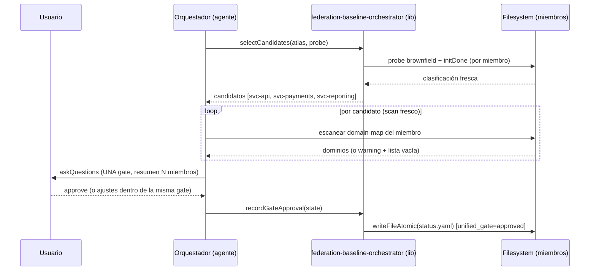
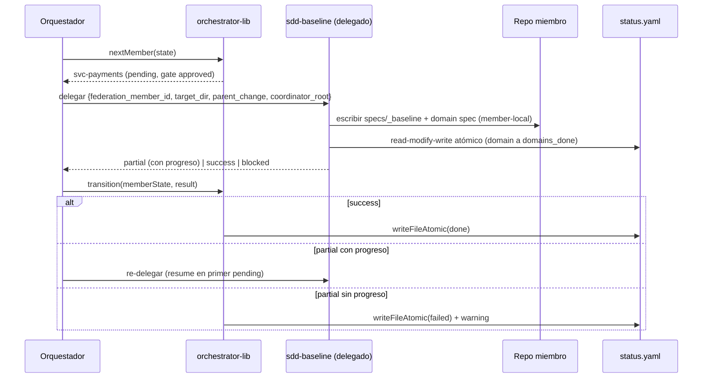
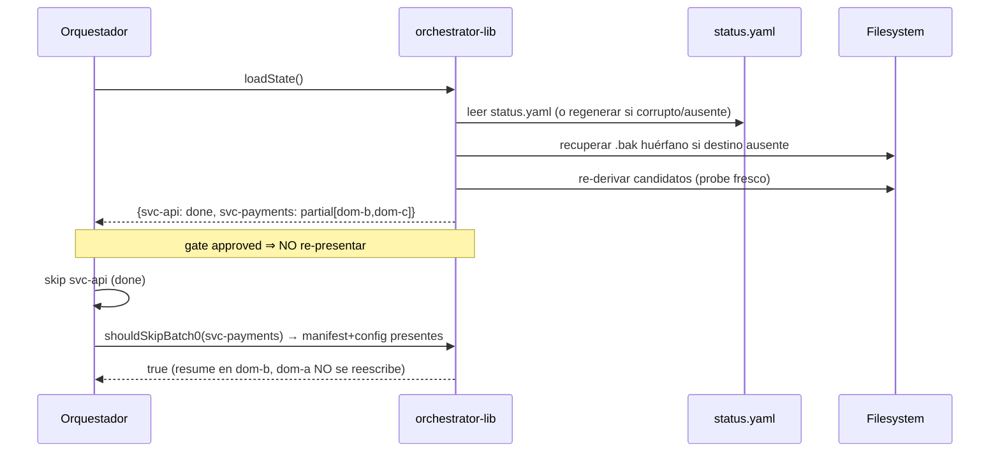
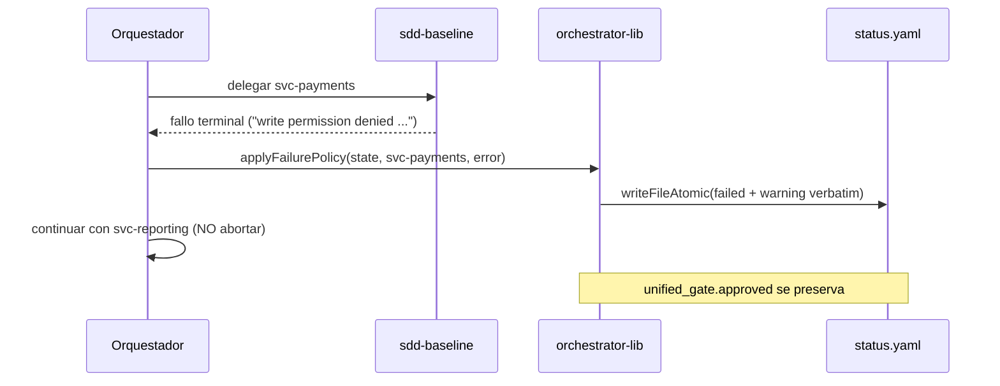

# Design: Orquestación Resumible de Baseline Federado (C2)

## Technical Approach

C2 separa **dos planos** que hoy están fusionados en un prompt de agente no testeable:
el **plano de decisión** (qué miembro toca, en qué estado está, si se reintenta, si se
omite batch-0) y el **plano de efectos** (delegar `sdd-baseline`, presentar la gate con
`vscode/askQuestions`, escribir specs en el miembro). El plano de decisión se extrae a un
módulo puro `scripts/lib/federation-baseline-orchestrator.js`, cubierto por `node --test`;
el plano de efectos permanece en `agents/sdd-orchestrator.agent.md` (delegación + gate) y
en el `sdd-baseline` delegado (escritura member-local). Esta frontera es la única forma de
obtener cobertura TDD real, porque el prompt del orquestador es un documento Markdown
imposible de unit-testear (limitación heredada de C1).

El estado vive en un único fichero agregado por cambio, `federation-baseline-status.yaml`,
escrito siempre de forma **atómica** mediante un helper compartido nuevo
`scripts/lib/atomic-write.js` que canonicaliza temp+rename con fallback `.bak` en Windows y
recuperación de `.bak` huérfano al arranque (S3). Ese mismo helper reemplaza las escrituras
no atómicas de `workspace.yaml`/`workspace-map.md` en `federation-explore.js` (S3) y se
apoya en el tag `origin: explore` añadido a `enroll` para suprimir los warnings ruidosos
"no remote" (S1). Specs y design referenciados: `federated-baseline-orchestration`,
`unified-baseline-gate`, `sdd-baseline-federation-contract`, `marker-hygiene`,
`explore-transactional-barrier`.

## Architecture Decisions

### Decision: Lib pura `federation-baseline-orchestrator.js` (state machine extraída)

**Choice**: Aislar la lógica de selección, transición, idempotencia, guardia anti-bucle y
política de fallo en funciones puras (I/O inyectado vía un `probe`/`io` por parámetro), no
en el prompt del agente.

| Opción | Tradeoff | Decisión |
|--------|----------|----------|
| Lógica embebida en el prompt del orquestador | 0 cobertura unit; regresiones silenciosas | ❌ |
| Lib pura + agente como capa de efectos delgada | Requiere contrato claro lib↔agente; doble artefacto | ✅ |
| Servicio runtime/daemon | Sobre-ingeniería; no encaja en el harness multi-target | ❌ |

**Rationale**: TDD estricto está ACTIVO. La única lógica testeable de C2 es la máquina de
estados; el resto (delegación real, `askQuestions`) sólo se prueba con content-contracts
estáticos. Extraer la máquina de estados es obligatorio para los Success Criteria del
proposal.

### Decision: Estado agregado en el coordinador (Opción 1)

**Choice**: `openspec/changes/{change}/federation-baseline-status.yaml` como única fuente de
verdad por cambio; iteración secuencial.

**Alternatives considered**: lectura dinámica de cada `{member}/openspec/config.yaml`
(Opción 2c) o caché regenerable híbrida (Opción 3).

**Rationale**: el resume cross-repo exige saber con exactitud "qué miembro / qué dominio"
tras una interrupción sin abrir N repos. La Opción 2 multiplica I/O y fragiliza el resume;
la Opción 3 introduce dos fuentes de verdad en tensión. El estado agregado es además
amigable a TDD (un solo fichero mockeable). `brownfield`/`initDone` NO se persisten aquí:
se re-derivan por filesystem en cada escaneo (restricción W1).

### Decision: Resolución de `coordinator_root` (explícito → traversal → blocked)

**Choice**: orden estricto — (1) parámetro explícito `coordinator_root` inyectado por el
orquestador vía el mismo mecanismo `## Parameters` que `target_dir`; (2) fallback de
traversal ascendente desde `target_dir` buscando `openspec/changes/{parent_change}/`;
(3) si ninguno resuelve → `status: blocked` con `question_gate`, sin escribir specs.

**Alternatives considered**: sólo traversal ascendente (rompe en layout sibling donde el
coordinador NO es ancestro del miembro).

**Rationale**: layout-agnóstico. El orquestador siempre conoce su propia raíz, así que
SIEMPRE pasa `coordinator_root`; el traversal es sólo resiliencia. Resuelve la
contradicción sibling-vs-nested del contrato (decisión aprobada `coordinator-root-001`).

### Decision: Escritura atómica canónica con fallback Windows (`atomic-write.js`)

**Choice**: helper compartido `writeFileAtomic(targetPath, content)` = escribir `{t}.tmp`
→ rename; en Windows, si rename falla con destino existente: `target → target.bak`,
`tmp → target`, borrar `.bak`. Al inicio de cualquier read/write, si el destino está
ausente y existe un `.bak` huérfano, restaurar `.bak → target` antes de continuar. Stale
`.tmp` se sobrescribe incondicionalmente.

**Alternatives considered**: `fs.writeFile` directo (corrupción en crash); dependencia
externa tipo `write-file-atomic` (viola "no nuevas deps" implícito del harness).

**Rationale**: POSIX rename es atómico; Windows necesita el fallback documentado. Centraliza
S3 + la escritura del status agregado en un único punto testeable, evitando duplicar la
lógica en `enroll` (que ya hace temp+rename simple) y en `federation-explore.js`.

### Decision: Frontera read-and-link (D10) — el coordinador delega, nunca escribe

**Choice**: el coordinador SÓLO lee markers/config como probes y escribe su propio
`federation-baseline-status.yaml`. Todo write SDD (`specs/`, `config.yaml`, manifest) lo
ejecuta exclusivamente el `sdd-baseline` delegado bajo `target_dir`.

**Rationale**: preserva D10 heredado de C1. La selección de miembros nace de los markers C1
y el límite de autoría cross-cutting queda fuera de scope (v2).

## Data Model

### `federation-baseline-status.yaml` (coordinador, gitignored / change-scoped)

```yaml
change: federated-baseline-orchestration
generated_at: 2026-06-18T16:30:00Z
unified_gate:
  status: pending | approved
  approved_at: 2026-06-18T16:31:00Z | null
  approver: vscode/askQuestions | null
members:
  - id: svc-payments              # member.id del marker canónico (C1)
    target_dir: ../svc-payments   # raíz del repo miembro
    baseline_status: pending | partial | done | failed
    domains_pending: [domain-b, domain-c]
    domains_done: [domain-a]
    warnings: ["..."]             # acumulado verbatim por miembro
    updated_at: 2026-06-18T16:32:00Z
```

Reglas: escritura siempre atómica (`atomic-write.js`); el agente delegado actualiza SÓLO su
propia entrada (no toca las de otros miembros); `brownfield`/`initDone` NUNCA se almacenan.

### Contrato `## Parameters` del `sdd-baseline` delegado

| Parámetro | Tipo | Obligatoriedad (modo federado) | Descripción |
|---|---|---|---|
| `federation_member_id` | string | MUST | Activa el modo federado; `member.id` del marker |
| `target_dir` | string | MUST | Raíz del repo miembro (write target de specs/config) |
| `parent_change` | string | MUST | Nombre del cambio coordinador |
| `coordinator_root` | string | SHOULD (el orquestador SIEMPRE lo pasa) | Raíz del coordinador; fallback = traversal |

Activación: la presencia de `federation_member_id` activa el modo federado. En modo estándar
estos parámetros DEBEN estar ausentes y no ser requeridos. `federation_member_id` presente
SIN `target_dir` ⇒ `blocked` con `question_gate` (sin writes).

## State Machine

### Transiciones per-miembro

```
                 unified_gate=approved
   ┌──────────┐   + delegate              ┌──────────┐
   │ pending  │ ───────────────────────▶  │ partial  │
   └──────────┘                           └────┬─────┘
        │ delegate (todos los dominios          │ re-delegate
        │  en un batch) → success               │  CON progreso
        │                                        │ (≥1 dominio pending→done)
        ▼                                        ▼
   ┌──────────┐    domains_pending == []    ┌──────────┐
   │   done   │ ◀──────────────────────────│ partial  │
   └──────────┘                             └────┬─────┘
                                                 │ partial SIN progreso
   ┌──────────┐  fallo terminal de baseline      │ (stuck-partial guard)
   │  failed  │ ◀───────────────────────────────┘
   └──────────┘     continue-log-retry            o fallo de delegación
        │  --retry-failed (idempotency check, gate NO re-presentada)
        └──────────────────────────────▶ pending/partial
```

Invariantes:
- **Idempotencia (skip batch-0)**: `manifest.md` ∧ `config.yaml` presentes bajo
  `{member}/openspec/specs/_baseline/` ⇒ omitir batch-0, reanudar en primer pending. Señal
  canónica = ambos ficheros; NUNCA `baseline_status` solo.
- **Gate unificada**: una sola aprobación cubre todos los miembros; se omite globalmente
  cuando `unified_gate.status: approved` (incluido `--retry-failed`).
- **stuck-partial guard**: `partial` sin que ningún dominio pase de `domains_pending` a
  `domains_done` respecto a la delegación previa ⇒ fallo terminal (acota reintentos por nº
  de dominios; sin número mágico).
- **continue-log-retry**: fallo terminal ⇒ `baseline_status: failed` + warning verbatim
  (id, dominio/batch, error exacto) + continuar; NUNCA invalida `unified_gate`.

### Bucle del orquestador (orden determinista por `workspace.yaml`, ties por `member.id`)

1. Recuperar/regenerar `federation-baseline-status.yaml` (corrupto/ausente ⇒ todos
   `pending`). Recuperar `.bak` huérfano si aplica.
2. Re-derivar candidatos por probe filesystem (`brownfield ∧ ¬initDone`); loggear
   `skipped-greenfield` / `skipped-initialized`.
3. Si `unified_gate.status != approved` ⇒ escanear domain-maps frescos de TODOS los
   candidatos y presentar **una** gate; registrar aprobación atómica.
4. Por candidato en orden: `done`→skip; `partial`→delegar con `domains_pending`;
   `pending`+gate aprobada→delegar; `failed`→skip salvo `--retry-failed`.
5. Tras éxito ⇒ marcar `done` atómico; tras fallo terminal ⇒ continue-log-retry.

## Data Flow / Sequence Diagrams

### (a) Gate batch-0 unificada sobre N miembros brownfield



### (b) Bucle secuencial resumible con delegación + estado agregado



### (c) Resume tras interrupción



### (d) Fallo de miembro — continue path



## File Changes

| File | Action | Purpose |
|------|--------|---------|
| `scripts/lib/federation-baseline-orchestrator.js` | Create | Lib pura: `selectCandidates`, `nextMember`, `transition`, `hasForwardProgress` (stuck-guard), `shouldSkipBatch0`, `resolveCoordinatorRoot`, `applyFailurePolicy`, parse/serialize del status. I/O inyectado. |
| `scripts/lib/atomic-write.js` | Create | `writeFileAtomic` (temp+rename + fallback `.bak` Windows) + `recoverOrphanBak` + limpieza de `.tmp` stale. Canon S3 para todo write path C2. |
| `scripts/lib/federation-explore.js` | Modify | S3: usar `writeFileAtomic` para `workspace.yaml`+`workspace-map.md` (dos ops atómicas independientes, parcial = warning). S1: pasar `origin: explore` al `enroll`. |
| `scripts/lib/federation-marker.js` | Modify | S1: `enroll` escribe/preserva `origin` con precedencia `explore < init < manual` (no degradar; byte-stable si sólo cambia origin). |
| `scripts/lib/workspace-atlas.js` | Modify | S1: suprimir warning "no remote" (miembro y roster) cuando el marker fuente tiene `origin: explore`; propagar `origin` en `mergeMarkersIntoAtlas`. Mantener warning para `init`/`manual`/legacy. |
| `agents/sdd-orchestrator.agent.md` | Modify | Sección federation baseline loop: derivar candidatos, gate unificada, delegar con parámetros, continue-log-retry, `--retry-failed`, referencia a la lib como fuente de decisión. |
| `agents/sdd-baseline.agent.md` | Modify | `## Parameters` federación; write target member-local; resolución `coordinator_root`; skip batch-0 por manifest+config; update atómico del status. |
| `skills/sdd-baseline/SKILL.md` | Modify | Documentar invocación federada, parámetros, localización del estado agregado, write target member-local, skip batch-0. |
| `.gitignore` | Modify | Ignorar `openspec/changes/*/federation-baseline-status.yaml*` (working file, no canónico). |
| `commands/*.prompt.md` / generación 4-target | Modify (si aplica) | Sincronizar docs/prompts que enumeran parámetros de delegación si el generador lo exige (`manifest-sync`). |

### Tests a añadir/extender

| Test file | Action | Cobertura |
|-----------|--------|-----------|
| `scripts/lib/federation-baseline-orchestrator.test.js` | Create | State machine, selección, idempotencia, stuck-guard, coordinator_root, failure policy, parse/serialize. |
| `scripts/lib/atomic-write.test.js` | Create | temp+rename normal, crash post-tmp, write failure preserva original, fallback `.bak` Windows, recuperación `.bak` huérfano, stale `.tmp`. |
| `scripts/lib/federation-explore.test.js` | Modify | S3: escritura atómica de ambos artefactos; parcial-success warning. S1: `origin: explore` en markers escritos. |
| `scripts/lib/federation-marker.test.js` | Modify | `origin` precedencia/no-degradación, byte-stability. |
| `scripts/lib/workspace-atlas.test.js` | Modify | Supresión warning por `origin`; init/manual/legacy preservan warning; no-break C1. |
| `scripts/federation-baseline-contract.test.js` | Create | Content-contract estático: `sdd-orchestrator`/`sdd-baseline`/SKILL contienen parámetros, gate unificada, read-and-link, continue-log-retry. |

## Testing Strategy

| Layer | Qué se prueba | Cómo |
|-------|---------------|------|
| Unit (pure lib) | State machine completa, selección `brownfield ∧ ¬initDone`, orden determinista, idempotencia, stuck-guard, `resolveCoordinatorRoot` (3 ramas), failure policy, parse/serialize status | `node --test`, I/O inyectado (probe mock) |
| Unit (atomic) | Escritura atómica, fallback Windows, recuperación `.bak` huérfano, stale `.tmp`, write-failure preserva original | `node --test` + `fs.mkdtemp` |
| Unit (S1) | Tag/precedencia `origin`, supresión selectiva de warnings, no-break C1 | `node --test` |
| Integration | Layout multi-miembro real: candidatos, resume con `done`/`partial`, fallo de un miembro continúa, sibling vs nested `coordinator_root`, escritura member-local | `fs.mkdtemp` con N miembros + delegación simulada (returns mockeados) |
| Content-contract (agente) | Presentación de gate vía `askQuestions`, loop de delegación/relaunch, parámetros inyectados — NO unit-testeables (Markdown) | Asserts estáticos sobre el contenido de los `.agent.md`/`SKILL.md` |

### Mapeo MUST/SHALL → capa de test (incluye error-paths)

- Member Selection (brownfield/initDone derivados; skip greenfield/initialized; nunca leer del marker) → **Unit lib**.
- Aggregated State File (creación, update tras éxito, supervivencia a crash mid-write) → **Unit atomic + integration**.
- Sequential Per-Member Loop (single/multi, orden preservado) → **Unit lib (orden) + integration**.
- Resume Semantics (mid-loop, full crash sin state) → **Integration**.
- Idempotency (manifest+config ⇒ skip batch-0; fully done skip) → **Unit lib + integration**.
- Member Failure Policy (uno falla → otros continúan; retry sin re-gate; warning verbatim) → **Integration + unit (failure policy)**.
- Read-and-Link Boundary (probe read-only; no escribir specs de miembro desde coordinador) → **Integration (asserta cero writes coordinador) + content-contract**.
- Unified Gate (una gate; single-member sigue unificada; ajuste = un evento; approval atómico; re-present si falta record; skip si approved) → **Content-contract (presentación) + unit (skip/record en status)**.
- Federation Invocation Parameters (activación; ausencia = estándar; parciales = blocked) → **Content-contract + unit (validación de parámetros)**.
- Member-Local Write Target → **Integration (path bajo `target_dir`)**.
- Aggregated State Update Protocol + coordinator_root (sibling, traversal, indeterminate=blocked) → **Unit lib (`resolveCoordinatorRoot`) + integration**.
- Batch-0 Skip (ambos ficheros; config ausente ⇒ no skip) → **Unit lib + integration**.
- S1 Marker Hygiene (todos los escenarios) → **Unit (marker + atlas)**.
- S3 Transactional Barrier (todos los escenarios, incluida recuperación `.bak`) → **Unit (atomic) + federation-explore integration**.

Error-paths explícitos: state corrupto → regenerar; `coordinator_root` indeterminado →
blocked; `federation_member_id` sin `target_dir` → blocked; partial sin progreso → failed;
write failure → original intacto; rename Windows falla → no corrupción; filesystem de
miembro inaccesible en gate → incluido con warning + lista vacía (no omisión silenciosa).

## Risks & Mitigations

| Riesgo | Likelihood | Mitigación |
|--------|------------|-----------|
| Warning roster "no remote" no existe hoy en `mergeMarkersIntoAtlas` (sólo el de miembro en `loadMarkerFromMember`) | Medium | El diseño asigna la supresión por `origin` en ambos emisores; si el emisor roster no existe, S1 sólo añade la propagación de `origin` y deja el comportamiento miembro suprimido. Verificar en apply antes de "añadir" un warning nuevo. |
| Doble write path del status (agente delegado + orquestador) sobre el mismo fichero | Medium | Secuencial en v1 (sin concurrencia, decisión `parallelization: sequential`); read-modify-write atómico suficiente. Cada escritor toca sólo su entrada. |
| Drift lib↔agente (la lógica vive en lib pero el agente la "narra") | Medium | Content-contract tests fijan los invariantes del agente; la lib es la fuente ejecutable. |
| Gate unificada pesada con muchos miembros | Low/Medium | Aceptable en v1; confirmación per-member on-demand diferida a v2. |
| Crash a mitad del bucle | Low | Estado se actualiza SÓLO post-delegación exitosa; atomic write + recuperación `.bak`. |

## Migration / Rollout

No requiere migración de datos. `federation-baseline-status.yaml` es un working file
nuevo (gitignored). El modo federado se activa exclusivamente por `federation_member_id`;
el `sdd-baseline` single-repo permanece byte-idéntico en comportamiento.

## Rollback Plan

Cambio high-risk; rollback completo:
1. Revertir el commit / feature branch `feat/federated-baseline-orchestration` (lib nueva,
   `atomic-write.js`, ediciones de orquestador/baseline, S1/S3).
2. Eliminar `federation-baseline-status.yaml` generado (estado de coordinación; no afecta
   specs de miembros, que son append-only y locales).
3. Las specs baseline ya escritas en `{member}/openspec/specs/` permanecen válidas.
4. Sin la lib, el orquestador vuelve al gate brownfield single-repo de C1 (sin pérdida de
   capacidad heredada).

## Open Questions

- [ ] Confirmar en apply si el warning "roster entry has no remote" debe AÑADIRSE (no existe
      hoy) o si S1 sólo suprime el warning de miembro existente. No bloquea el diseño: la
      supresión por `origin` cubre ambos casos.
