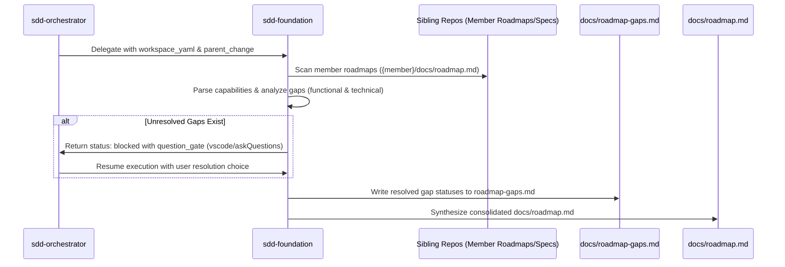

# Design: Roadmap y Gaps en Workspace Federado (C5)

## Technical Architecture

El módulo `sdd-foundation` cooperará con el orquestador para procesar los roadmaps locales de los miembros y mapear los gaps antes de generar el roadmap consolidado y la matriz de gaps.

### 1. Flujo de Datos de Gaps y Q&A



### 2. Formato del Reporte de Gaps (`docs/roadmap-gaps.md`)

El reporte se estructurará con las siguientes secciones:
- **Resumen**: Estado general de gaps (Total, Resueltos, Pendientes).
- **Gaps Funcionales**: Tabla con el ID del Gap, Descripción, Estado (Asignado a Miembro X / Diferido / Pendiente) y Resolución.
- **Gaps Técnicos**: Tabla con el ID del Gap, Tipo (Desalineación / Contrato), Detalles, Estado y Resolución.

### 3. Registro de Aprobaciones (Approvals)

Cuando un gap se resuelva a través del Q&A gate, la resolución se guardará en `openspec/changes/federated-roadmap-gaps/state.yaml` bajo el ledger de approvals:
```yaml
approvals:
  - id: resolve-gap-func-001
    gate: gap-resolution
    decision: "assigned: api"
    source: vscode/askQuestions
    accepted_at: ISO-8601
    applies_to:
      - sdd-foundation
```
Y se agregará de forma persistente a `openspec/config.yaml` en una sección `gaps_resolutions` para asegurar su persistencia.
