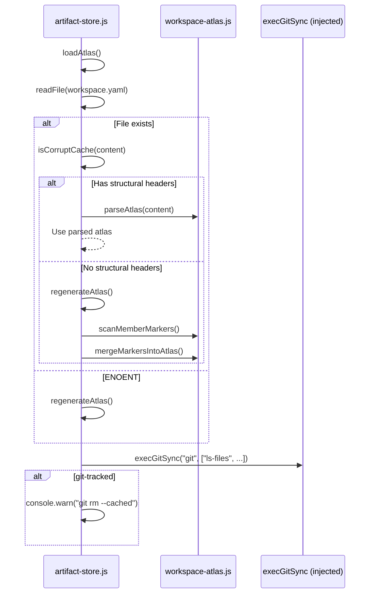

# Design: federation-c1-hardening (C6)

## Overview

Five targeted fixes across 4 production modules, 1 test file, and 1 spec file. No public interface changes, no hook behavior changes. All fixes are backward-compatible.

---

## Architecture Decisions

### AD-1: Structural vs semantic corruption detection

**Decision**: Use structural detection — check whether the raw content contains recognizable YAML section headers (`members:` at indent 0 or `contracts:` at indent 0) rather than relying on parsed array lengths.

**Rationale**: `parseAtlas` is intentionally lenient (never throws). Empty arrays after parsing valid YAML headers means "workspace is empty" — a legitimate state. Empty arrays after parsing garbage means "YAML was not recognizable" — that's corruption. The structural check discriminates between these two cases without adding a `initialized` field to the schema.

### AD-2: DI seam at factory level, not module level

**Decision**: Add `execGitSync` as an optional parameter to `createWorkspaceFederatedStore` (and propagated through `createArtifactStore` / `createArtifactStoreFromConfig`).

**Rationale**: Module-level mocking (`jest.mock` style or `proxyquire`) is fragile across CJS/ESM boundaries and the project uses no test framework that supports it. Parameter injection is explicit, typesafe, and works with the native Node.js test runner.

### AD-3: Explicit `roster: []` in explore markers

**Decision**: Write `roster: []` explicitly in explore-generated markers rather than relying solely on warning suppression.

**Rationale**: Defense in depth. The suppression in `mergeMarkersIntoAtlas` already prevents the warning, but an explicit empty roster makes the marker self-documenting and prevents future regressions if someone adds a new code path that checks for roster presence.

---

## File Changes

### `openspec/specs/workspace-explore/spec.md`

| Section | Change |
|---------|--------|
| Purpose | Replace "emission of canonical markers" with explicit cross-reference to `federation-markers` spec |
| Requirement: Explore Artifacts | Add note: "Marker schema and field definitions are authoritative in `federation-markers` spec" |

---

### `scripts/lib/artifact-store.js`

| Function | Change |
|----------|--------|
| `isCorruptCache(content, parsed)` | Replace heuristic: check for structural markers (`members:` or `contracts:` at indent 0) in raw content instead of checking parsed array lengths |
| `createWorkspaceFederatedStore(workspace, opts)` | Accept `{ execGitSync }` in opts; default to imported `spawnSync` |
| `warnIfGitTracked()` | Use `execGitSync` from closure instead of direct `spawnSync` |
| `createArtifactStore(opts)` | Propagate `execGitSync` to `createWorkspaceFederatedStore` |
| `createArtifactStoreFromConfig(opts)` | Propagate `execGitSync` |

#### `isCorruptCache` — new implementation

```javascript
function isCorruptCache(content) {
  if (!content.trim()) {
    return false;
  }
  // A structurally valid atlas has at least one top-level section header.
  // parseAtlas is lenient (never throws), so garbage → empty arrays, but
  // also empty-but-valid → empty arrays. Discriminate by checking whether
  // the raw content contains the expected YAML headers.
  const hasStructure = /^members:/m.test(content) || /^contracts:/m.test(content);
  return !hasStructure;
}
```

#### DI seam — factory change

```javascript
function createWorkspaceFederatedStore(workspace, { execGitSync = spawnSync } = {}) {
  // ...
  function warnIfGitTracked() {
    try {
      const result = execGitSync("git", ["ls-files", "openspec/workspace.yaml"], {
        cwd: workspace,
        encoding: "utf8",
      });
      // ... (unchanged logic)
    } catch {
      // ... (unchanged)
    }
  }
  // ...
}
```

---

### `scripts/lib/artifact-store.test.js`

| Test | Change |
|------|--------|
| "warns but keeps loading when workspace.yaml is git-tracked" (line 368) | Refactor: inject mock `execGitSync` instead of calling real `git`. Keep as unit test. |
| NEW: "empty workspace is not corrupt" | Verify that a structurally valid but empty `workspace.yaml` is NOT regenerated |
| NEW: "corrupt content triggers regeneration" | Verify that garbage YAML triggers regeneration (regression for existing behavior) |
| KEEP: existing `gitAvailable()` guarded test | Optionally keep as smoke test with `t.skip` guard |

---

### `scripts/lib/federation-explore.js`

| Function | Change |
|----------|--------|
| `buildMemberData(containerId, memberDir, classification)` | Add `roster: []` to returned object |
| Module-level comment | Update to reflect C6 hardening |
| All exported functions | Add JSDoc `@param` / `@returns` |

---

### `scripts/lib/workspace-atlas.js`

| Function | Change |
|----------|--------|
| All exported functions (`computeImpact`, `isWithinRoot`, `loadMarkerFromMember`, `mergeMarkersIntoAtlas`, `parseAtlas`, `resolveMembers`, `scanMemberMarkers`, `serializeAtlas`) | Add JSDoc `@param` / `@returns` |

---

### `scripts/lib/federation-marker.js`

| Function | Change |
|----------|--------|
| Exported functions | Add JSDoc `@param` / `@returns` |

---

### `scripts/lib/federation-baseline-orchestrator.js`

| Function | Change |
|----------|--------|
| Exported functions | Add JSDoc `@param` / `@returns` |

---

## Sequence Diagram



## Test Strategy

- **Unit tests**: All new behavior tested via mocks and DI
- **Regression**: Existing tests must pass unchanged (except the refactored git-tracked test)
- **Integration**: Keep the `gitAvailable()` guarded smoke test as a separate optional test
- **Run command**: `npm test`
